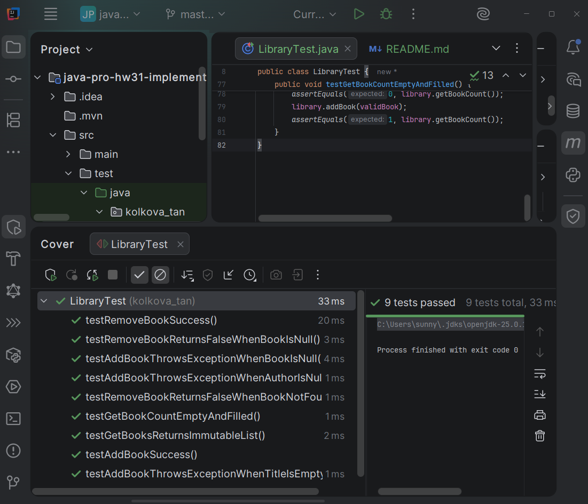
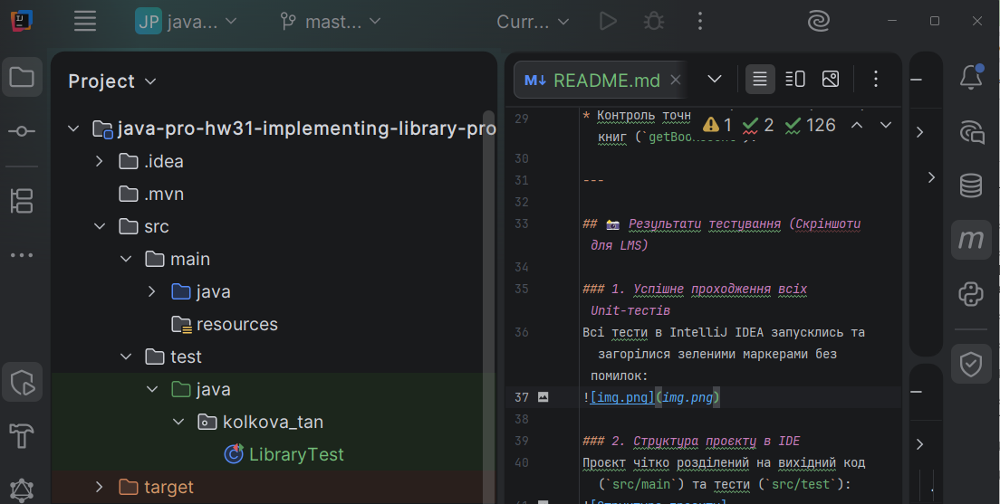

# Реалізація класу Library та покриття Unit-тестами (JUnit 5)

Цей проєкт є виконанням практичного завдання з розробки об'єктно-орієнтованої логіки для керування бібліотекою книг (`Library` та `Book`) із повним покриттям коду модульными тестами.

## 🚀 Стек технологій
* **Java** (версія 25)
* **JUnit Jupiter (JUnit 5)** — бібліотека для тестування
* **Maven** — система автоматизації збирання проєктів
* **IntelliJ IDEA** — середовище розробки

---

## 🛠️ Опис реалізації

### 1. Клас `Book` (Модель даних)
* Містить обов'язкові поля: `title` (назва) та `author` (автор).
* Перевизначено методи `equals()` та `hashCode()` за обома полями, що дозволяє коректно порівнювати книги між собою за змістом, а не за посиланнями в пам'яті.
* Реалізовано метод `toString()` для зручного логування.

### 2. Клас `Library` (Бізнес-логіка)
* Реалізовано підхід **Fail-Fast**: методи здійснюють строгу валідацію вхідних параметрів. Якщо передано `null` або пусті рядки в назві/авторі книги — генерується виключення `IllegalArgumentException`.
* Метод `getBooks()` повертає **unmodifiable** (немодифіковану) копію списку за допомогою `Collections.unmodifiableList()`. Це захищає внутрішню колекцію бібліотеки від випадкових прямих змін ззовні.

### 3. Тестовий клас `LibraryTest`
Покриває всі основні позитивні та негативні сценарії:
* Успішне додавання та видалення книг.
* Перевірка реакції на `null`-об'єкти, пусті назви та відсутність авторів.
* Перевірка неможливості модифікації списку книг ззовні.
* Контроль точного підрахунку кількості книг (`getBookCount`).

---

## 📸 Результати тестування (Скріншоти для LMS)

### 1. Успішне проходження всіх Unit-тестів
Всі тести в IntelliJ IDEA запусклись та загорілися зеленими маркерами без помилок:

### 2. Структура проєкту в IDE
Проєкт чітко розділений на вихідний код (`src/main`) та тести (`src/test`):
